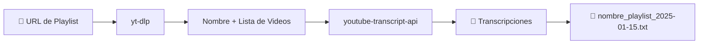

<p align="center">
  <h1 align="center">🎬 Transcriptor de Playlists de YouTube</h1>
  <p align="center">
    Extrae automáticamente las transcripciones de todos los videos de una playlist de YouTube<br/>
    en un solo archivo de texto ordenado — con el nombre de la playlist como nombre del archivo.
  </p>
</p>

<p align="center">
  
  
  
  
</p>

---

## ✨ Características

- 🎯 **Extracción masiva** — Transcribe todos los videos de una playlist completa
- 📝 **Nombre automático** — Detecta el nombre de la playlist y lo usa como nombre del archivo
- 🌍 **Multi-idioma** — Soporta transcripciones en español, inglés, y más (`es`, `en`, `es-419`)
- ⚡ **Un clic** — Doble clic en el `.bat` y listo, instala todo automáticamente
- 🔄 **Procesamiento continuo** — Al terminar una playlist, queda listo para procesar otra
- 🖥️ **Dos interfaces** — Web (Flask) para navegador + Escritorio (Tkinter) para uso local
- 🐳 **Docker ready** — Despliega con Docker sin instalar Python

---

## 🚀 Inicio Rápido

### Opción 1: Windows (sin Docker)

> Requisito: [Python 3.10+](https://www.python.org/downloads/) instalado con "Add to PATH" marcado.

1. Clona o descarga el repositorio
2. **Doble clic** en `Iniciar_Transcriptor.bat`
3. ¡Listo! Se abre tu navegador automáticamente

El script crea el entorno virtual, instala las dependencias y lanza el servidor. Todo automático.

### Opción 2: Docker

> Requisito: [Docker Desktop](https://www.docker.com/products/docker-desktop/) instalado y corriendo.

1. **Doble clic** en `Iniciar_Con_Docker.bat`
2. ¡Listo! Se abre tu navegador en `http://localhost:8000`

Si algo falla, el script te dice exactamente qué necesitas instalar.

### Instalación manual

```bash
# Clonar el repositorio
git clone https://github.com/tu-usuario/transcriptor-playlists.git
cd transcriptor-playlists

# Crear entorno virtual
python -m venv .venv

# Activar entorno virtual
.venv\Scripts\activate          # Windows
source .venv/bin/activate       # Linux / macOS

# Instalar dependencias
pip install -r requirements.txt

# Ejecutar la interfaz web
python src/web_app.py

# O ejecutar la interfaz de escritorio
python src/app.py
```

---

## 📁 Estructura del Proyecto

```
📦 transcriptor-playlists/
│
├── 🚀 Iniciar_Transcriptor.bat    ← Lanzador Windows (sin Docker)
├── 🐳 Iniciar_Con_Docker.bat      ← Lanzador Docker
├── 📄 README.md
├── 📄 LICENSE
├── 📋 requirements.txt
├── 📄 .gitignore
│
├── 📂 src/                        ← Código fuente
│   ├── ⚙️ core.py                 │  Lógica principal (extracción, transcripción)
│   ├── 🌐 web_app.py              │  Interfaz web (Flask)
│   └── 🖥️ app.py                  │  Interfaz de escritorio (Tkinter)
│
├── 📂 docker/                     ← Configuración Docker
│   ├── Dockerfile
│   └── docker-compose.yml
│
├── 📂 tests/                      ← Tests
│   └── test_filename.py
│
└── 📂 transcripciones/            ← Archivos de salida (.txt)
    └── .gitkeep
```

---

## 🛠️ ¿Cómo Funciona?



1. **Entrada** — Pegas la URL de una playlist de YouTube
2. **Detección** — `yt-dlp` obtiene el nombre de la playlist y la lista de videos
3. **Transcripción** — `youtube-transcript-api` descarga los subtítulos de cada video
4. **Guardado** — Se genera un `.txt` con el nombre de la playlist + fecha, en `transcripciones/`
5. **Siguiente** — La interfaz queda lista para procesar otra playlist inmediatamente

---

## 📋 Dependencias

| Paquete                   | Propósito                          |
|---------------------------|-------------------------------------|
| `flask`                   | Servidor web e interfaz             |
| `yt-dlp`                  | Extracción de datos de YouTube      |
| `youtube-transcript-api`  | Obtención de transcripciones        |

---

## 🤝 Contribuir

1. Haz un **fork** del repositorio
2. Crea una **branch** para tu feature (`git checkout -b feature/nueva-funcion`)
3. Haz **commit** de tus cambios (`git commit -m 'Agrega nueva función'`)
4. Haz **push** a la branch (`git push origin feature/nueva-funcion`)
5. Abre un **Pull Request**

---

## 📄 Licencia

Este proyecto está bajo la licencia **MIT**. Consulta el archivo [LICENSE](LICENSE) para más detalles.

---

<p align="center">
  Hecho con ❤️ para la comunidad hispanohablante
</p>