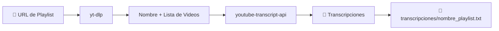

<p align="center">
  <h1 align="center">🎬 Transcriptor de Playlists de YouTube</h1>
  <p align="center">
    Extrae automáticamente las transcripciones de todos los videos de una playlist de YouTube<br/>
    en un solo archivo de texto ordenado — con el nombre de la playlist como nombre del archivo.
  </p>
</p>

<p align="center">
  
  
  
</p>

---

## ✨ Características

- 🎯 **Extracción masiva** — Transcribe todos los videos de una playlist completa
- 📝 **Nombre automático** — Detecta el nombre de la playlist y lo usa como nombre del archivo
- 🌍 **Multi-idioma** — Soporta transcripciones en español, inglés, y más
- ⚡ **Un clic** — Doble clic en un `.bat` y listo, instala todo automáticamente
- 🔄 **Procesamiento continuo** — Al terminar una playlist, queda listo para otra

---

## 🚀 Dos formas de usar

### 🖥️ Programa de escritorio (sin Docker)

> Requisito: [Python 3.10+](https://www.python.org/downloads/) con "Add to PATH" marcado.

**Doble clic en `Iniciar_Transcriptor.bat`**

Se abre un programa de escritorio en Windows. Pegas la URL, le das clic y las transcripciones se guardan en la carpeta `transcripciones/`.

El script instala todo automáticamente la primera vez.

---

### 🐳 Interfaz web (con Docker)

> Requisito: [Docker Desktop](https://www.docker.com/products/docker-desktop/) instalado y corriendo.

**Doble clic en `Iniciar_Con_Docker.bat`**

Se abre una interfaz web moderna en tu navegador (`http://localhost:8000`). Todo corre dentro de un contenedor Docker.

Si Docker no está instalado o no está corriendo, el script te avisa qué hacer.

---

## 📁 Estructura del Proyecto

```
📦 transcriptor-playlists/
│
├── 🚀 Iniciar_Transcriptor.bat    ← Programa de escritorio (sin Docker)
├── 🐳 Iniciar_Con_Docker.bat      ← Interfaz web (con Docker)
├── 📄 README.md
├── 📄 .gitignore
│
├── 📂 src/                        ← Código fuente
│   ├── core.py                    │  Lógica principal
│   ├── app.py                     │  Programa de escritorio (Tkinter)
│   └── web_app.py                 │  Interfaz web (Flask)
│
├── 📂 docker/                     ← Configuración Docker
│   ├── Dockerfile
│   └── docker-compose.yml
│
├── 📂 tests/                      ← Tests
│   └── test_filename.py
│
└── 📂 transcripciones/            ← Aquí se guardan las transcripciones
    └── .gitkeep
```

---

## 🛠️ ¿Cómo funciona?



1. Pegas la URL de una playlist de YouTube
2. `yt-dlp` obtiene el nombre de la playlist y la lista de videos
3. `youtube-transcript-api` descarga los subtítulos de cada video
4. Se genera un `.txt` con el nombre de la playlist en `transcripciones/`
5. Queda listo para procesar otra playlist

---

## 🤝 Contribuir

1. Haz un **fork** del repositorio
2. Crea una **branch** (`git checkout -b feature/nueva-funcion`)
3. Haz **commit** (`git commit -m 'Agrega nueva función'`)
4. Haz **push** (`git push origin feature/nueva-funcion`)
5. Abre un **Pull Request**

---

<p align="center">
  Hecho con ❤️ para la comunidad hispanohablante
</p>